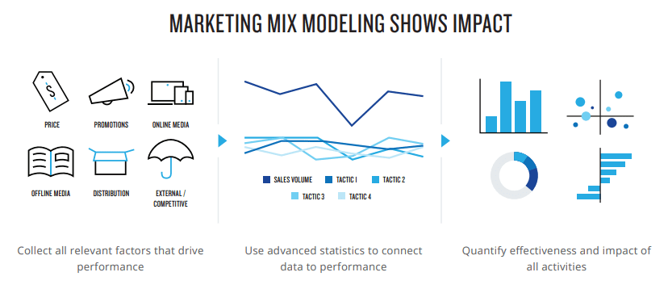
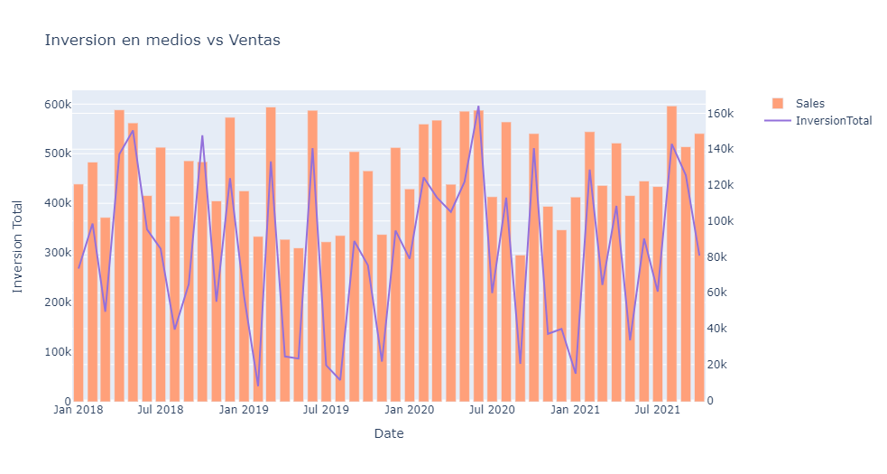

# ⚗️ Marketing Mix Modeling

Uno de los mayores problemas del marketing digital es la atribución. Dado que los clientes reciben múltiples impactos online y offline, no siempre es fácil saber qué canales ofrecen mejores resultados.

El Marketing Mix Modelling ofrece una solución a este problema aplicando tecnicas estadisticas, de manera que nos permite saber cuál es el impacto de cada canal en las ventas y cómo ajustar la inversión para conseguir los mejores resultados.

## *"La mitad del dinero que me gasto en publicidad es un desperdicio: el problema es que no sé qué mitad es"*

John Wanamaker

## Seccion de Aprendizaje

- Teoria 1: [Modelo de Marketing Mix Simple](./Teoria1/README.md)
- Teoria 2: [Modelo de Marketing Mix Avanzado](./Teoria2/README.md)

# Implementacion

Data (Sample 5 rows):
| Date       |  OpenTV |   PayTV |   Radio |   Print | Facebook |  Google |   Email |   Sales |
|:-----------|--------:|--------:|--------:|--------:|---------:|--------:|--------:|--------:|
| 4/4/2021   |       0 | 16677.1 | 10839.4 |       0 |  4164.39 | 6391.03 |  3365.5 |  135432 |
| 8/2/2020   |       0 |       0 |       0 | 1804.14 |        0 |       0 | 902.076 | 71603.1 |
| 12/13/2020 |       0 |       0 |       0 | 2129.99 |        0 |       0 | 1008.78 | 84476.4 |
| 9/22/2019  |       0 |       0 |       0 |  1345.1 |        0 |       0 | 938.553 | 91300.6 |
| 10/25/2020 | 13322.5 | 14461.8 |  9267.8 |       0 |  4829.18 | 8315.63 | 3720.83 |  144281 |

## Analisis Exploratorio de Datos "EDA"

### Data Describe

La base cuenta con 200 registros y 9 variables/features

- tiempo - Date
- inversion - Print
- inversion - Email
- inversion - Radio
- inversion - Facebook
- inversion - Google
- inversion - PayTV
- inversion - OpenTV
- Ventas - Sales

Tenemos regsitros de ventas desde 2018 hasta 2021
donde podemos ver que el crecimiento de las ventas esta relacionado con la inversion en medios

