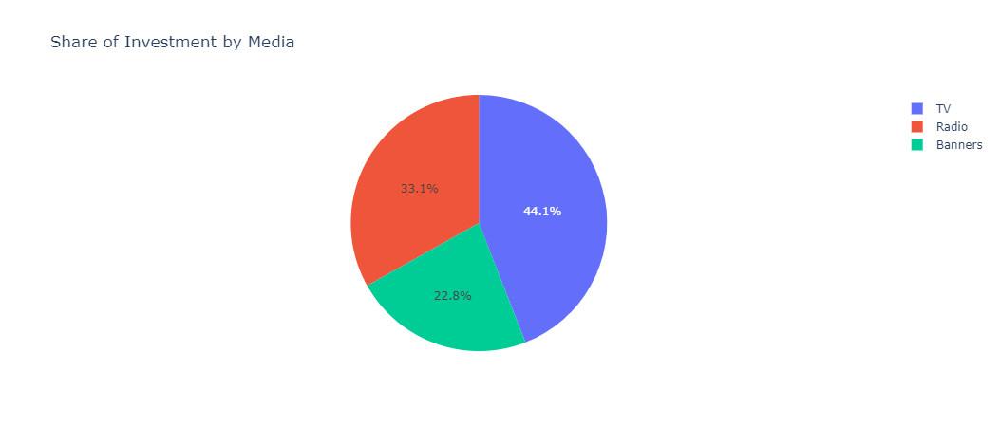
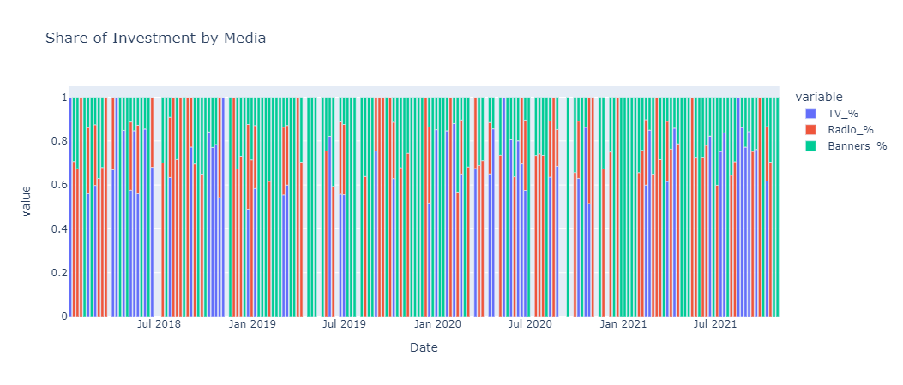
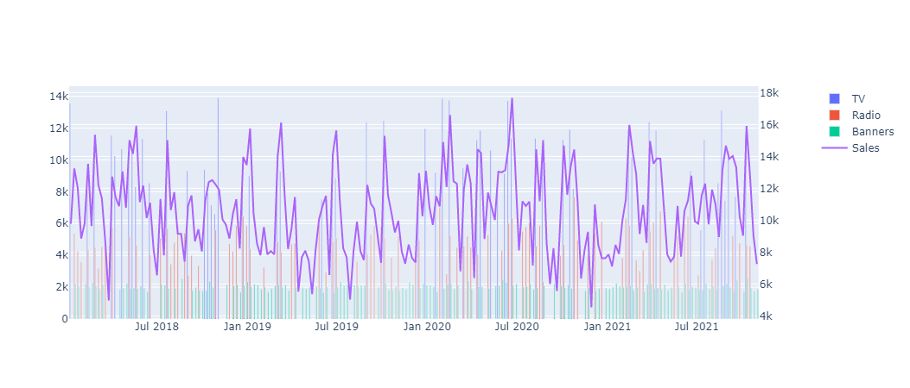

# Introduccion al Marketing Mix Modeling en Python

¿Qué inversión publicitaria está impulsando realmente sus ventas?

## Links

- [Blog](https://towardsdatascience.com/introduction-to-marketing-mix-modeling-in-python-d0dd81f4e794)
- [Data](https://github.com/Garve/datasets/blob/4576d323bf2b66c906d5130d686245ad205505cf/mmm.csv)
- [JupyterNotebook](Teoria1MMMSimple.ipynb)

## Explicacion

El marketing mix modelo es una herramienta para analizar la inversión publicitaria que está impulsando las ventas de una empresa.

Para resolver este problema, se necesita una base de datos de ventas, que contiene la cantidad de ventas en un periodo de tiempo

## Desarrollo

### EDA(Analisis Exploratorio de Datos)

- Tipos de datos y descripcion del dataset:

|Variable|Descripcion|
|:-------|:----------|
|TV|Inversion publicitaria en televisión|
|Radio|Inversion publicitaria en radio|
|Banner|Inversion publicitaria en banners|
|Date|Fecha de las Inversiones y Ventas|
|Sales|Cantidad de ventas|

- El dataset no contiene valores nulos
- Los datos vienen ordenados por semanas
- La distribucion de las variables es:

|medio|count|mean|std|min|25%|50%|75%|max|
|:----|:----|:----|:----|:----|:----|:----|:----|:----|
|TV|200.0|2946.2076500000003|4749.6469075106115|0.0|0.0|0.0|7938.5275|13901.55|
|Radio|200.0|2213.5850499999997|2505.967886401654|0.0|0.0|0.0|4624.0275|7696.22|
|Banners|200.0|1520.7225500000009|870.7643535088615|0.0|1657.195|1918.99|2069.7675|2518.88|
|Sales|200.0|10668.141500000002|2700.706683299734|4532.33|8396.9425|10853.105|12566.994999999999|17668.34|

Se puede ver que no tenemos inversion para: 

- tv en mas del 50% de las semanas
- Radio en mas del 50% de las semanas
- Banner tenemos inversion en mas del 25% de las semanas

- El medio que tiene mas inversion es TV siguiendole Radio y despues Banners 
  

- Durante todo el periodo de tiempo se observa que el medio mas activo es banner

- Podemos observar que las ventas responden a la inversion publicitaria con mas fuerza en el medio de TV

### Modelo de Marketing Mix Simple
El objetivo es obtener el valor de contribucion de cada medio, para generar ventas y saber cual seria el mejor monto de inversion para cada medio.

Se utilizara un modelo de regresion lineal multiple ya que este es un modelo aditivo, y con este podremos obtener el valor de contribucion de cada medio.

**Formula**

*Regresion lineal Multiple*

$Y_{Ventas} = f(X_{Tv}) + g(X_{Radio}) + h(X_{Banners}) + Base$

La Base es la cantidad de ventas base que se tiene sin ninguna inversion, es decir el valor de la variable $y_{ventas}$ cuando $x_{inversion}$ es $0$

Implementamos el modelo con la libreria de scikit-learn, y obtenemos los valores de las variables de inversion y pesos para cada medio.

- Interseccion: 6678.36

Pesos:
- Tv : 0.35
- Radio : 0.48
- Banner : 1.21
  
Por lo que nuestro medelo quedaria de la siguiente manera:

$Y_{Ventas} = 0.35(X_{Tv}) + 0.50(X_{Radio}) + 1.13(X_{Banners}) + 6935.73$

Al utilizar este modelo, vemos que tiene un margen de error que corregimos con la creacion de un factor de correccion

$correctFactor = \frac{Y_{sales}}{Y_{salesPredict}}$

aplicamos el factor de correccion para obtener el valor real de las ventas generadas por cada medio

### ROI
Retornos de Inversión

Una vez que tenemos el valor de contribucion de ventas de cada medio, podemos calcular el retorno de inversión de cada medio con la siguiente formula:

$ROI = \frac{VentasMedio}{InversionMedio}$

Entomces obteniendo el ROI de cada medio, podemos concluir que:

Por cada $1$ dolar de inversion recuperamos en :

- TV ROI: $0.35$
- Radio ROI: $0.50$
- Banners ROI: $1.13$

Aun que este aun es un modelo muy simple que no captura la realidad del problema, es una buen paso para iniciar a plantear preguntas mas complejas.

Como:

- ¿Si banners tiene el mejor ROI deberiamos de invertir todo el presupuesto en banners?
- ¿Podriamos tener ventas exponenciales si invertimos exponencialmente en banners?

En el siguiente [Proyecto](../Teoria2/README.md) resolveremos estos problemas.
